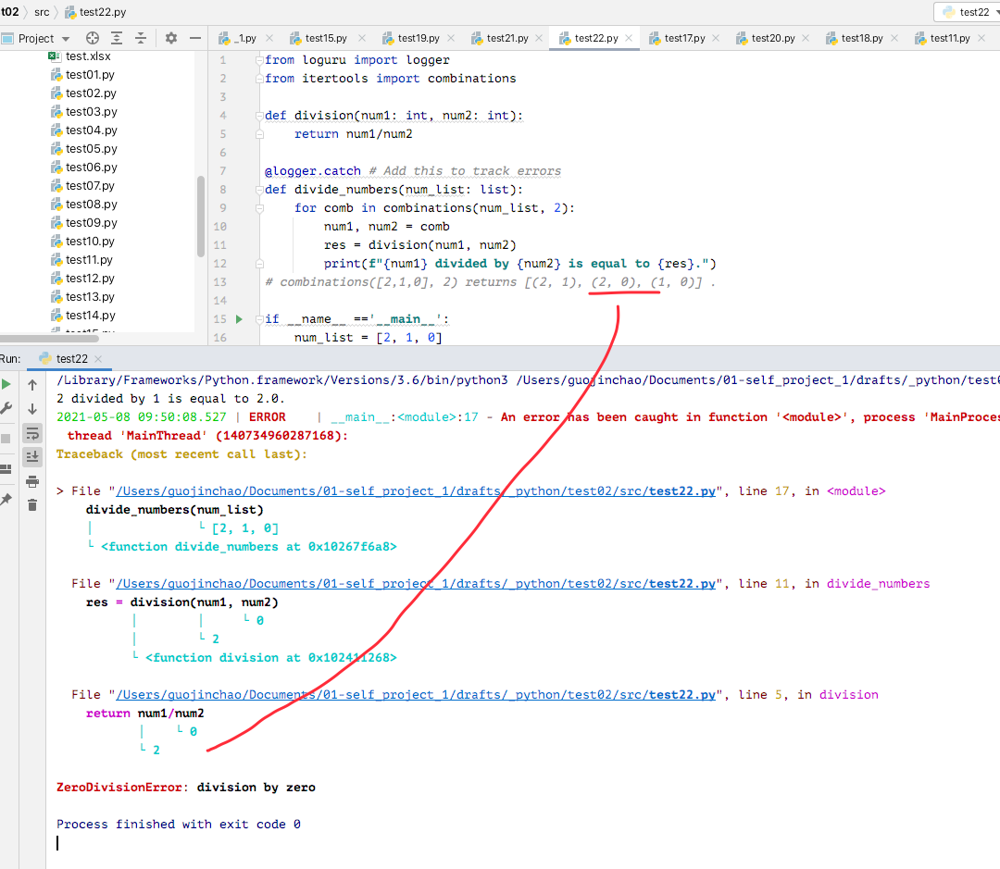
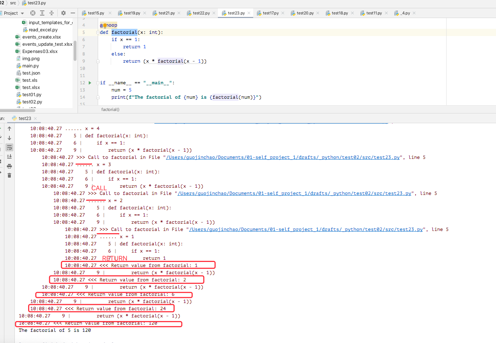
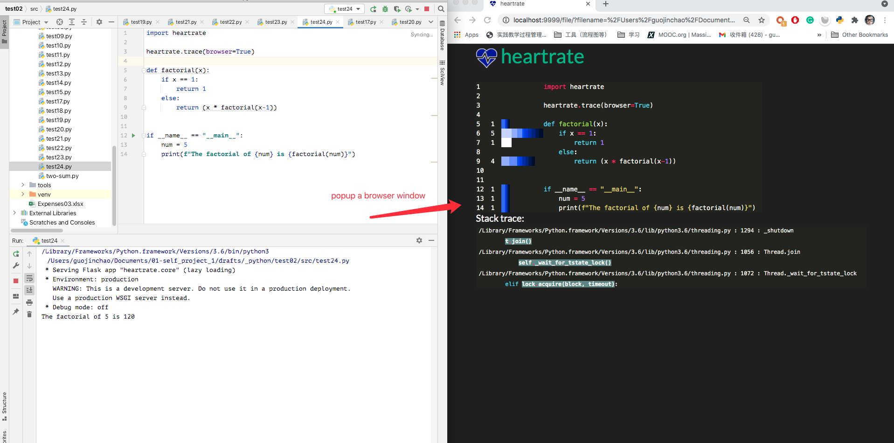

# 2020

## ✅week19(1h 50min)

---

### [3 Tools to Track and Visualize the Execution of your Python Code](https://towardsdatascience.com/3-tools-to-track-and-visualize-the-execution-of-your-python-code-666a153e435e)

### overview

1. motivation
   1. optimize error log output format to easy to understande
   2. combinations(p,r)
      1. [api url](https://docs.python.org/3/library/itertools.html)
      2. 排列组合
      3. `combinations([2,1,0], 2)` returns `[(2, 1), (2, 0), (1, 0)]` .

### Tools

#### 1. Loguru — Print Better Exceptions - accurate positioning

> pip3 install loguru

- use in main function by annotation
  - `@logger.catch`

#### 2. snoop - help you understanding proj more clearly

> pip3 install snoop

#### 3. heartrate - Visualize the Execution of a Python Program in Real-Tim

> pip install heartrate

`The longer bars mean more hits`

`lighter colors mean more recent`

### conclution

Awesome tools for debugging!
