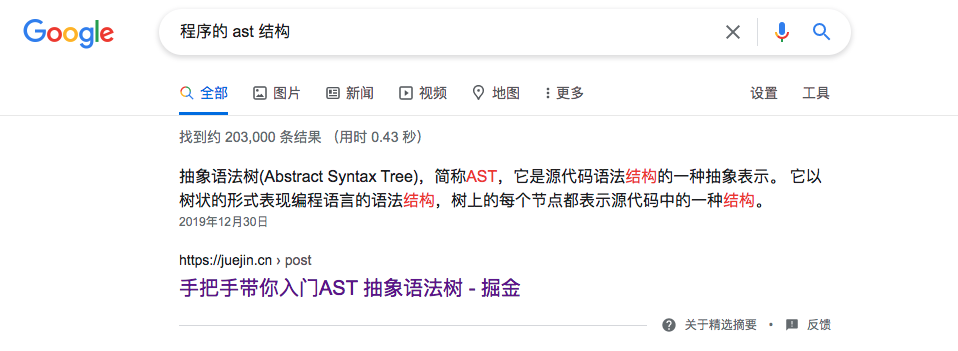

# 2021

| Title                                                        | MyCode                                                       | Week    | 序号 |
| ------------------------------------------------------------ | ------------------------------------------------------------ | ------- | ---- |
| 本机IP地址、127.0.0.1和0.0.0.0的区别                         | https://istw7xze8e.feishu.cn/docs/doccnfWgkJJOFghl2X35WMsSlRh | ✅week19 | 001  |
| 认证 (authentication) 和授权 (authorization) 的区别          | https://istw7xze8e.feishu.cn/docs/doccnfWgkJJOFghl2X35WMsSlRh#wL9veE | ✅week20 | 002  |
| 如何掌握所有的程序语言                                       | [如何掌握所有的程序语言](http://www.yinwang.org/blog-cn/2017/07/06/master-pl) | ✅week21 | 003  |
| [编辑器与IDE](http://www.yinwang.org/blog-cn/2013/04/20/editor-ide) |                                                              | ✅week22 | 004  |
| [雷军：创业第一课](https://www.youtube.com/watch?v=cZgTCsOYaHI&list=PLTwuZpOIOsIRl6mEDW6_oeRi-mXR2rth3&index=3&ab_channel=%E8%81%8A%E8%81%8ATalkTalk) |                                                              | ✅week23 | 005  |
| [英语学习的一些经验](http://www.yinwang.org/blog-cn/2020/03/06/english-learning-tips) |                                                              | ✅week24 | 006  |

---

## 004. 编辑器与IDE

> http://www.yinwang.org/blog-cn/2013/04/20/editor-ide

`很多人对 IDE 有偏见，因为他们认为这些工具让编程变得“傻瓜化”了，他们觉得写程序就是应该“困难”，所以他们眼看着免费的 IDE 也不试一下。有些人写 Java 都用 Emacs 或者 vi，而不是 Eclipse 或者 IntelliJ。可是这些人错了。他们没有意识到 IDE 里面其实蕴含了比普通文本编辑器高级很多的技术。这些 IDE 会对程序文本进行真正的 parse，之后才开始分析里面的结构。它们的“跳转到定义”一般都是很精确的跳转，而不是像文本编辑器那样瞎猜。`

`这种针对程序语言的操作可以大大提高人们的思维效率，它让程序员的头脑从琐碎的细节里面解脱出来，所以他们能够更加专注于程序本身的语义和算法，这样他们能写出更加优美和可靠的程序。这就是我用 Eclipse 写 Java 程序的时候相对于 Emacs 的感觉。我感觉到自己的“心灵之眼”能够“看见”程序背后所表现的“模型”，而不只是看到程序的文本和细节。所以，我经常发现自己的头脑里面能够同时看到整个程序，而不只是它的一部分。我的代码比很多人的都要短很多也很有很大部分是这个原因，因为我使用的工具可以让我在相同的时间之内，对代码进行比别人多很多次的结构转换，所以我往往能够把程序变成其他人想象不到的样子。`

AST - Abstract syntax tree

> https://en.wikipedia.org/wiki/Abstract_syntax_tree
>
> https://juejin.cn/post/6844904035271573511

## 5. 雷军：创业第一课

[视频链接](https://www.youtube.com/watch?v=cZgTCsOYaHI&list=PLTwuZpOIOsIRl6mEDW6_oeRi-mXR2rth3&index=3&ab_channel=%E8%81%8A%E8%81%8ATalkTalk)

标题取得唬人，说什么创业第一课，但是里面的内容都是真的实实在在的干货，雷军踏踏实实像一个老大哥真诚的分享，全程没有吹牛逼，看的都是肺腑之言。

分别是两大部分交集

1. 雷军的商业经历
2. 雷军的做事经验

通篇如果只能记住几个字，主要是了两个词

1. 做事踏实
2. 建立自己的信誉

---

## 6. [英语学习的一些经验](http://www.yinwang.org/blog-cn/2020/03/06/english-learning-tips)

1. 先理解句子架构 - 把句子当函数，架构就是方法体
2. 语法和句子结构才是关键 - 词汇量其次
3. 记单词用小本子记下来，不要用手机，不认识就多看看小本子
4. 可以把专业术语 就是标记成 专业术语「」直角括号标记可以
5. 用牛津字典

