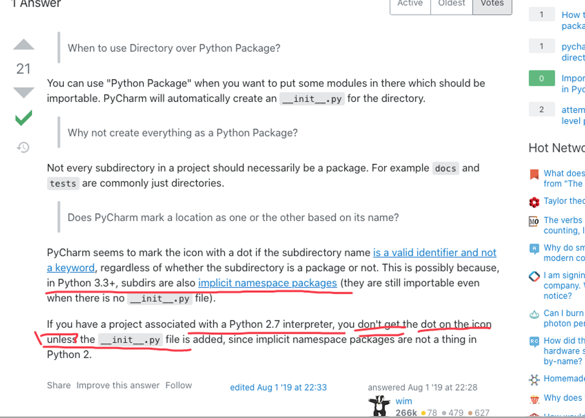
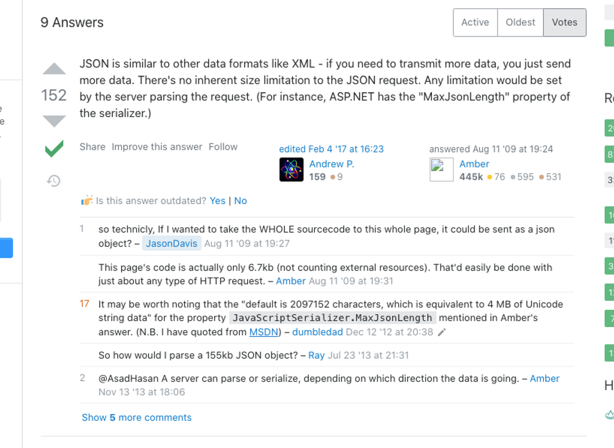
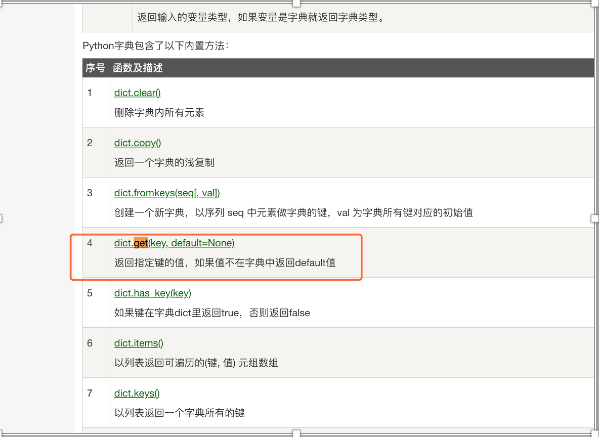
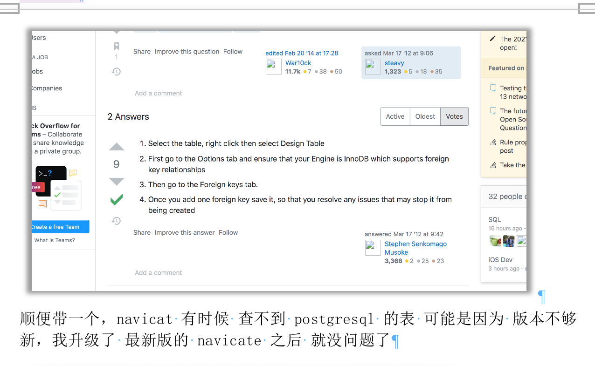

# 2021

| Title                                                        | empty | Week    | 序号 |
| ------------------------------------------------------------ | ----- | ------- | ---- |
| [「关于初识如何阅读源码」](https://istw7xze8e.feishu.cn/docs/doccnR8Rj41YRCRSI9VtcJaoICc#xxYuD2) |       | ✅week19 | 001  |
| [关于数据库范式的体会](#✅week20-002)                         |       | ✅week20 | 002  |
| [python, json max size, mardown](#✅week21-003)               |       | ✅week21 | 003  |
| [ Json 格式化校验, 防止字典键值对不存在,  Navicat 如何查看 外键](#✅week22-004) |       | ✅week22 | 004  |
| 如果 github 私有库显示找不到库                               |       | ✅week23 | 005  |


## ✅week15

---

### Postman 软件

- 下载地址
  - https://www.postman.com/downloads/
- 可以模拟 各种请求 用来测试 api
- 可以方便的把 各种请求 都放在一个文件夹下面管理


#### 1. 模拟用户登录

https://blog.csdn.net/qq_34861341/article/details/102885211

**原理：**

```
在 headers 中 放入 cookie 里的 session id

因为 服务器 保持会话就是 通过 session 的
```

| key    | 表头                                                |
| ------ | --------------------------------------------------- |
| Cookie | session_id=25dc48227c8cfb58a268a1300573ffd11827a1f8 |
|        |                                                     |

如果想模拟另外一个用户，就用 session_id 换成另一个人登录后在 浏览器中找到的 session_id

但是切换的时候 记得查看：

- Headers     Hide auto-generated headers
  - 这个选项要打开，看看是不是 这个请求已经隐藏了一个 cookie，要是是，就要先删除隐藏的，再添加


#### 2. 制作 json 请求

 直接在 请求的 body 里面 用 raw 形式，

直接 粘进去 json 就好了

```json
{
        "cate_name": "消耗品",
        "mat_name":"笔记本",
        "apply_num":"1",
        "apply_reason":"正常损坏了",
        "aly_commit":"申请理由",
}
```


## ✅week19-001

- 「关于初识如何阅读源码」
- https://istw7xze8e.feishu.cn/docs/doccnR8Rj41YRCRSI9VtcJaoICc#xxYuD2


## ✅week20-002

[How do I determine file encoding in OS x](https://stackoverflow.com/questions/539294/how-do-i-determine-file-encoding-in-os-x)

```bash
:~ guojinchao$ file -I /Users/guojinchao/Downloads/a.txt
>>>
/Users/guojinchao/Downloads/a.txt: text/plain; charset=iso-8859-1
```

mac 查看文件的 编码类型


**数据库第二范式的体现**

设计数据库的表还是需要「范式」，使用「范式」可以让数据库的结构设计更清晰，以后问题也会少很多。

案例：

背景：比如是 「订单系统」，订单系统有 针对订单的 售后记录，每个「问题订单」有 责任方，责任方 负责人不一定是同一个人，因为有很多人 在「处理订单」，不同订单，责任方负责人是会不一样的。

> - 对象
>
>   - 责任方
>   - 售后记录
>   - 责任方负责人( 随着售后记录不一样，责任方的负责人也会不一样 )
>
>   
>
> - 「责任方负责人」相关的「主键」其实是 「责任方+售后记录」
>
>   - 所以👆「责任方+售后记录」要单独建一张表
>   - ✅否则就违反了 **数据库设计「第二范式」**


### **references**

> 3.

> 数据库范式概念「解析」（第一范式，第二范式，第三范式）

> https://www.jianshu.com/p/cc51ce61f798

> ✅

> 第二范式（2NF）和第三范式（3NF）的概念很容易混淆

> 区分它们的关键点在于

> **2NF：「非主键列」是否「完全依赖」于「主键」，****还是「依赖」于「主键的一部分」，一部分就要重新编排一下**

> 3NF：「非主键列」是「直接依赖」于「主键」，还是「直接依赖」于「非主键」列。


## ✅week21-003

### 1. Python 包 和 文件夹的不同

**一句话总结：主要跟「导入-import」相关**

主要是 python2.7 以前 没有 init文件 不能 用 . 导入，python3.3 以后不管有没有 init 文件 都能 import

> https://stackoverflow.com/questions/57317624/difference-between-directory-and-python-package-in-pycharm



 

 

 

### 2. Json Max Size

一句话总结：没有限制，由服务器自行配置设置

https://stackoverflow.com/questions/1262376/is-there-a-limit-on-how-much-json-can-hold




### 3. markdown 链接到标题

> https://stackoverflow.com/questions/6695439/how-to-link-to-a-named-anchor-in-multimarkdown

例如👇

`[python, 编程语言, json max size, mardown](#✅week21-003)`


## ✅week22-004

### 1. Json 格式化校验
Json 格式化校验，可以显示哪行错了
https://www.bejson.com/

搜索来源
https://www.google.com/search?q=json+%E6%A0%BC%E5%BC%8F%E5%8C%96&oq=json&aqs=chrome.3.69i57j69i59l2j0i131i433j69i65l3j69i61.3189j0j7&sourceid=chrome&ie=UTF-8


### 2.	防止字典键值对不存在
https://www.runoob.com/python/python-dictionary.html



### 3. Navicat 如何查看 外键

https://stackoverflow.com/questions/9748698/table-relations-in-navicat



## ✅week24-005

### 如果 github 私有库显示找不到库

> https://github.community/t/fatal-repository-not-found/1180


git remote set-url origin https://xxxusername@github.com/aceofwings/RotairERP.git

试着重新关联地址，然后加上你的github 名，因为 私有库 有权限

git remote set-url origin https://username@github.com/xxx/xxx.git

